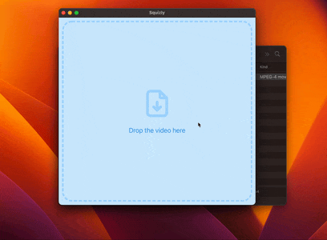

# Squizly

The simplest video compressor on macOS.



## Download

You can find it in the [releases page](https://github.com/matitalatina/squizly/releases).

- [Squizly for Apple Intel](https://github.com/matitalatina/squizly/releases/download/v1.0.1/Squizly-darwin-x64-1.0.1.zip)
- [Squizly for Apple Silicon M1](https://github.com/matitalatina/squizly/releases/download/v1.0.1/Squizly-darwin-arm64-1.0.1.zip)

## For Apple Silicon M1

When you download the app, extract the Squizly.app. Then, if you try to start it, you'll see the following message.

> “Squizly.app” is damaged and can’t be opened. You should move it to the Bin.

To fix this, open a terminal and run the following command.

```bash
xattr -r -d com.apple.quarantine /<PATH_TO_APP>/Squizly.app
```

## Support my work

Everything I made is open source.
If you like what I'm doing and you want to support me, you can help me 😄!

- Sponsor me with [Github](https://github.com/sponsors/matitalatina)
- [Buy me a coffee](https://www.buymeacoffee.com/mattianatali)
- [Paypal](https://paypal.me/mattianatali)

## Credits

Icon provided by <a href="https://www.flaticon.com/free-icons/compress" title="compress icons">Compress icons created by Smashicons - Flaticon</a>
